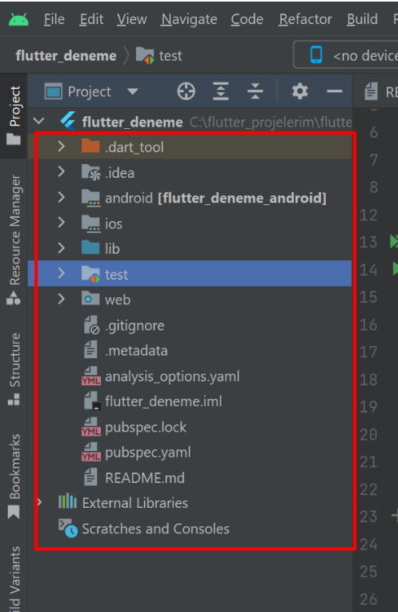

# 1 - Proje Oluşturma

## Visual Studio Code:

  VS Code içerisine Fluuter eklentileri kurulduktan sonra CTRL+SHIFT+P tuşlarına bastığımızda karşımıza gelen komut plaetinden Flutter:New Project seçilir.

## Android Studio:

  Programın açılış sayfasında Fluuter Project seçildiğinde yeni proje oluşturulur.
  
## Komut Satırı:

  Flutter projelerini kout satırından da oluşturabiliriz. Özellikle flutter projeyi ilk oluşturduğumuzda iskelet bir proje yapısını internetten indirerek kurar. Eğer internet bağlantımız yoksa projemizi çevrimdışı (offline) olarak kurmamız gerektiğinde komut satırını kullanabiliriz.

  Bunun için kullanıdığımız program üzerindeki Terminal arayüzünden veya Windows’taki CMD veya Powershell üzerinden projeyi oluşturacağımız klasörün içerisine girip aşağıdaki komutu yazmamız yeterlidir.
```
flutter create my_app

flutter create –offline my_app   
(Bu komut internet bağlantımız olmadığında çevrimdışı proje oluşturur.)
```

Projemizi çalıştırmak için ise proje klasörünün içindeyken “flutter run” komutu kullanılır.

# Proje Yapısı



## AndroidManifest.xml: 

### Paket İsmi
Paket ismi domain kurallarına göre oluşturulur

### Proje İsmi
Porocesslerde gözüken isimdir

### İzinler
  Uygulamamızda izinlerle ilgili yaptığımız ayarları içeriyor. Dosya yolu Android/app/src/main/
İzinler içi kullanılabilecek referans sayfası, https://developer.android.com/reference/android/Manifest.permission


## build.grade: 
Android ile ilgili bazı ayarları yaptığımız dosya. Android/app/
Min Sdk ayarı burada yapılır.

## pubspec.yaml: 
Devamlı kullanacağımız bir dosya. Kullanacağımız kütüphaneleri, resimleri, fontları, veritabanı gibi dosyalarımızı burada belirtiyoruz.
````
flutter pub get
````

##lib Klasörü: 
Projemize ait oluşturacağımız kodlar sınıflar bu klasör içerisinde yer alır. Projemiz çalıştırıldığında ilk önce buradaki main.dart isimli klasörü çalıştırır.


