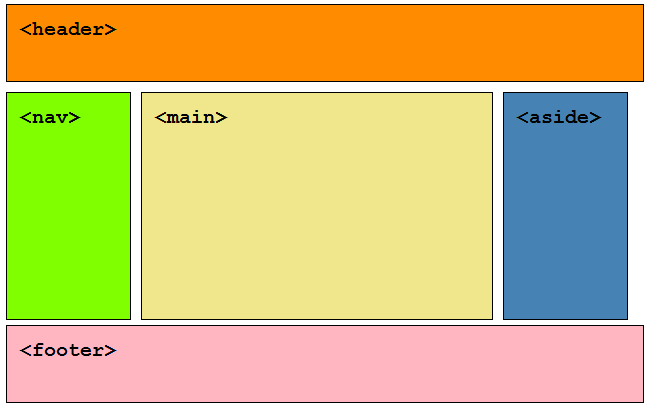
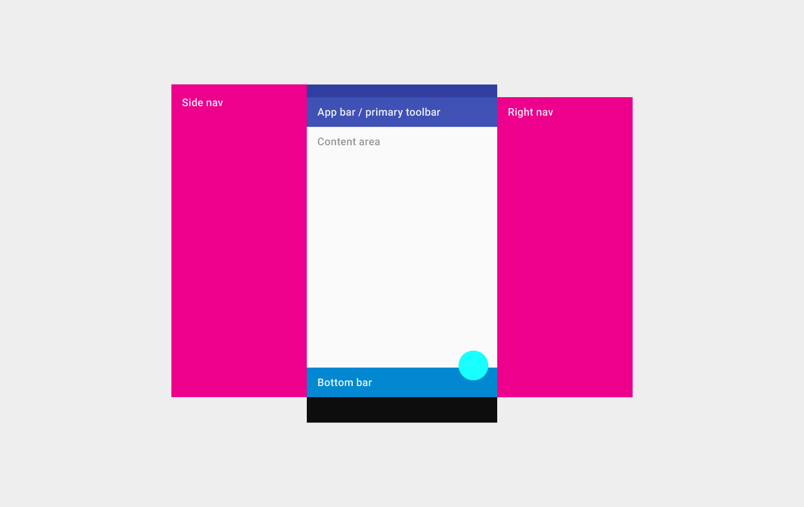
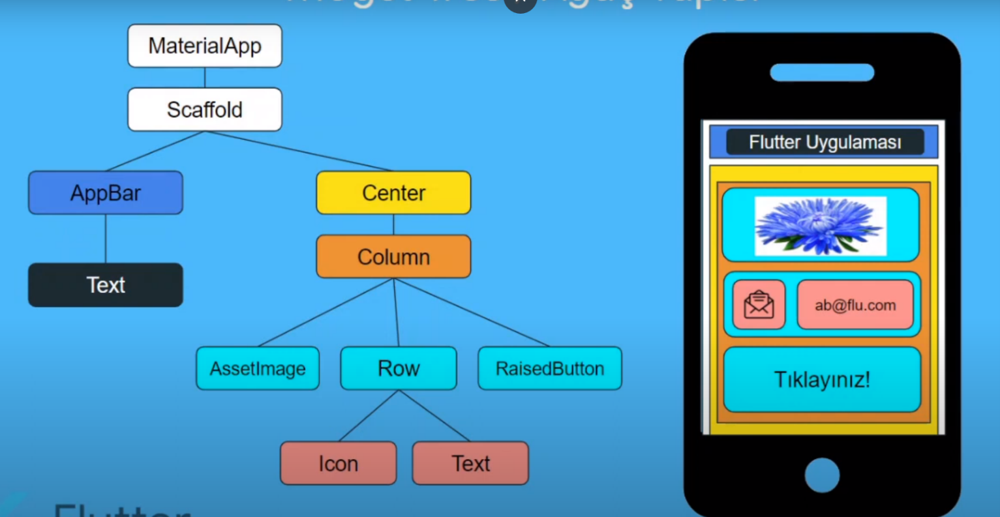

  Bu sayfada bulunduğunuza göre Flutter'ın ne olduğunu veya en azından ne amaçla kulanıldığını bildiğiniz düşünerek hemen programın kurulumlarını sizlere anlattık. Ama şimdi bilmeyenler ve yeni başlayanlar için Flutter ile ilgili bir ka temel konuya değinelim.

  Flutter, Google tarafından oluşturulan ve Mayıs 2017'de piyasaya sürülen ücretsiz ve açık kaynaklı bir Mobil UI Framework’üdür (çerçevesidir). Birkaç kelimeyle söylemek gerekirse, yalnızca tek bir kod tabanıyla yerel bir mobil uygulama oluşturmanıza olanak tanır. Bu, iki farklı uygulama (iOS ve Android için) oluşturmak için bir programlama dili ve bir kod tabanı kullanabileceğiniz anlamına gelir.

# Flutter iki önemli bölümden oluşur:

## 1-	SDK (Yazılım Geliştirme Kiti): 
  Uygulamalarınızı geliştirmenize yardımcı olacak araçlardan oluşan bir koleksiyon. Bu, kodunuzu yerel makine koduna (iOS ve Android kodu) derlemeye yönelik araçları içerir.
## 2-	Framework (widget'lara dayalı Kullanıcı Arayüzü Kitaplığı): 
  Kendi ihtiyaçlarınıza göre kişiselleştirebileceğiniz, yeniden kullanılabilir kullanıcı arayüzü öğelerinden (düğmeler, metin girişleri, kaydırıcılar vb.) oluşan bir koleksiyon.

# Flutter Ekran Tasarımı
  Flutter’da ekran tasarımları, widget ismi verilen yapılar ile kurulur. Widget’lar ekranda kullanılan nesnelere ait sınıflardır. Ekran tasarımı yapılırken widget’lar bir hiyerarşi ve ilişki içerisinde ekrana yerleştirilir. Biz buna widget tree ( widget ağacı ) deriz.

Widget ve ekran tasarım örneklerini aşağıdaki linklerden inceleyebilirsiniz.

https://docs.flutter.dev/ui/widgets

https://gallery.flutter.dev/#/

  Bootsrapt ile web sayfaları geliştirirken geliştiricilere, temel web sayfası arayüz tasarımlarında standart haline gelen ve temel kullanıcı alışkanlığı olan sayfalar için nasıl hazır tasarım araçları sunuyorsa Flutter'da arayüz tasarımlarında bu kullanım kolaylalığını Widget'lar ile sunuyor. 

  Web sayfası arayüz tasarımlarında, header, container, footer yapısı standart haline gelmiştir. Yaygın olarak kullanılan bu standartlar müşteri ve internet kullanıcıları için de kullanım alışkanlıkları kazandırmıştır. Mesela bir web sayfasını açtığımızda sayfanın üstünde banner bölümünde sayfa başlığı ve logo öğelerini görmeyi umarız. Banner altında sayfada gezinmek için bir menü ihtiyacı duyarız. Yine sayfanın en altında firma iletişim bilgileri, kullanıcı sözleşmeleri ve telif hakları gibi bilgiler yer alır. 

  Kullanıcılar bir web sayfasında gezinirken yukarıda anlattığımız alışkanlıklar doğrultusunda hareket eder. Aynı bu durum mobil uygulamalar için de geçerlidir.



  

  İşte Flutter burada devreye girmektedir. Flutter geliştiricilere Mobil Uygulamlarda standart haline gelmiş temel öğeleri ekrana getirip özelleştirme noktasında büyük kolaylık sunuyor. Flutter Material ve Cupertino widget sınıfları ile kullanıcılar hazır tema ve tasarım ilkelerine sahip widget'ları kullanmasını sağlar.

  Scafold widget'ı ile kullanıcılara bir iskelet yapısı sunar ve böylece kullanıcılar, istediği widget'ı ekranın istediği yerinde gösterebilir.


# Flutter main.dart dosyası

Flutter backend kısımda dart programlama dilini kullanır. Dart nesne yönelimli bir dildir. Flutter projeleri çalışmak için bir başlangıç dosyasına ve main methoduna ihtiyaç duyar. Eğer aksi belirtilmemişse Flutter projelerinin başlangıç dosyaı proje kök dizini içinde yer alan *lib* klasörünün içindeki main.dart dosyasıdır.

Flutter projesi çalıştırıldığında main.dart içerisindeki main metodu çalıştırılır.

````
void main() {
  runApp(const MyApp());
}

//Veya 

void main() =>  runApp(const MyApp());
````

main metdonunun içersinde projemizde oluşturacağımız uygulamamıza ait ana sınıf ismi ile birlikte runApp komutu ile çağrılıp çalıştırılır. Yukaridaki örnekte projemizimizin MyApp isimli ana sınıfı çağrılmıştır. Bu ana sınıf bir widget'tan türeyen başka bir widget sınıfıdır. MyApp ismi değiştirilerek kullanıcının istediği herhangi bir isim verilebilir.

MyApp sınıfı Flutter'da iki temel sınıftan birini miras alabilir. Bunlar StatelessWidget ve StatefulWidget widgetlardır. Bu widgetların temel açıklamalarına yer verilmek ile birlikte daha sonra ayrıntısı ile anlatılacaktır.

````
class MyApp extends StatelessWidget {
  const MyApp({super.key});

  // This widget is the root of your application.
  @override
  Widget build(BuildContext context) {
    return MaterialApp(
      title: 'Flutter Demo',
      theme: ThemeData(
        primarySwatch: Colors.blue,
      ),
      home: const MyHomePage(title: 'Flutter Demo Home Page'),
    );
  }
````

## State nedir? *

  State, oluşturduğumuz uygulamanın durumu olarak tanımlanabilir. Ekranın anlık görüntüsüdür. Bir ekranın görüntüsünü yani State’i etkileyen birçok widget vardır. Örnek vermek gerekirse: yazılar, resimler yine en basit örnekleridir. State değiştiğinde, ekrandaki görüntü de değişir. O yüzden, kullandığımız widgetlara göre state seçimini doğru kulanmak önemlidir.
  
## Stateful ve Stateless Widget farkı nedir? *

  Uygulamamızı Stateful veya Stateless widget sınıflarıyla oluşturuyoruz. Bu sınıflar da birer widgettır. Fakat neye göre Stateless veya Stateful widget sınıfı oluşturuyoruz, bu biraz kafa karıştırabiliyor. Şimdi sırayla incelediğimizde aslında çok kolay olduğunu beraber görebiliriz.

Öncelikle anlamlarına bakarak ip ucu yakalayabiliriz.

Stateless = Durumsuz,   Stateful = Durumsal 

Eğer, kullanacağımız ekranda değişen herhangi bir yapımız yoksa bunu Stateless widget kullanarak oluştururuz. Sabit yapılarla, durumsuz bir haldir. Yani değişen bir şey yoktur. Örnek olarak, koyacağımız bir başlık yazısı gibi değişmeyen widgetlarla, stateless widget kullanırız.

  Eğer, kullanacağımız ekranda widgetlarda değişiklik olacaksa bunu Stateful widget kullanarak oluştururuz. Değişken yapılarla, durumsal bir haldir yani belirli durumlara sahiptir. Örnek olarak, ekranda bir saat göstermek istersek veya sayaçlı bir sistem gibi sürekli değişen değerlerde, stateful widget kullanırız.


## MaterialApp ve CupertinoApp Kök Widgetları

Bu widgetler ekranımızın kök widgetları olup tasarımımızın temel kriterlerini belirler. Material tasarımı ekranımıza eklenen widgetlarda Material tasarım renkleri ve stilleri kullanırken, Cupertino IOS tarzı bir tasarım ve stilleri kullanır. 




* Kaynak: Kadriye Mucit - https://www.mobilhanem.com/flutter-widgetlar-ve-stateless-stateful-widget-farki/


