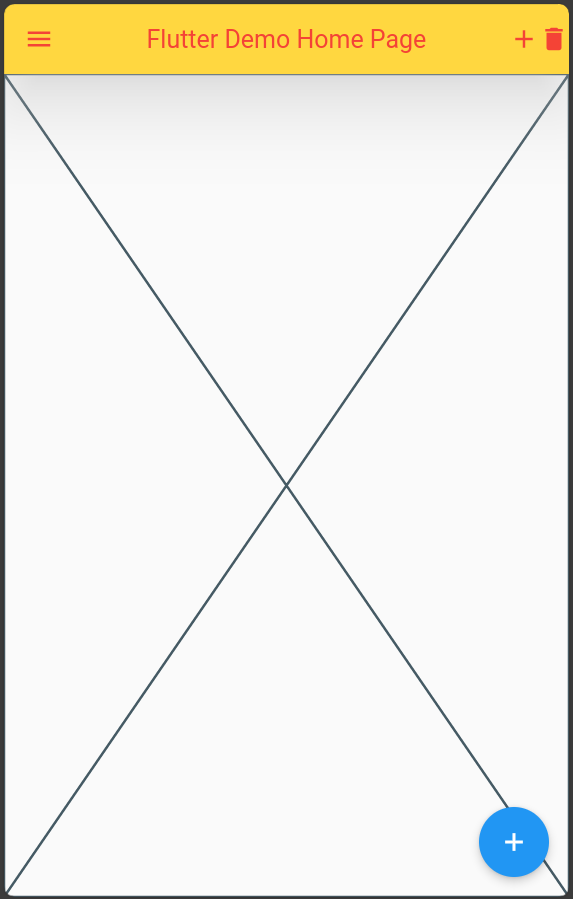

# AppBar

  Bu widget mobil uygulamalrınızda banner özelliği görmektededir. Uygulama ismi ve logosu gibi nesneler bu bölümde yer alabilir.

  

  AppBar widget'ı Scaffold widgetının appbar özelliğine atayarak kullanabiliriz.

````
home: Scaffold(
        appBar: AppBar(
          title: const Text('Flutter Demo Home Page'),
        ),
````


## AppBar Özellikleri

AppBar widget2 da diğer widgetlar gibi bir sınıftır ve özelleştirilebilen özellikleri vardır.

Bunlar:
  title: AppBar'da gözükmesini istediğimiz başlık burada yer alır. widget türünden bir parametre bekler. Burada Text widget'ı kullanılarak ekrana bir metin yazdırılabilir.
  
  backgroundColor: Arka plan rengini belirler. Renk vermek için Colors sınıfından faydalanılabilir.
  
  foregroundColor: Yazırengini ayarlar.
  
  leading: Başlık bölümünden önce yer alan bölümdür. Başka widgetlarda da bu alan bulunabilir. Genellik Icon'larla doldurululur.
  
  actions: Başlık bölümünden sonra kullanıcıya AppBar üzerinden ulaşabileceği farklı widgetlar için alan sağlar.

  centerTitle: Başlığı ortalar. ortalamak için değeri true olarak ayarlanır.
  
  shadowColor: AppBar altına gölge atar.
  
  elevation: Gölgenin yayılma alanının büyüklüğünü belirler.
  
  titleSpacing: leading veya actions kullanılmadığı zaman AppBar'ın yatay eksenlerindeki boşluğu sağlar.

````
//main.dart

import 'package:flutter/material.dart';

void main() {
  runApp(const MyApp());
}

class MyApp extends StatelessWidget {
  const MyApp({super.key});

  // This widget is the root of your application.
  @override
  Widget build(BuildContext context) {
    return MaterialApp(
      title: 'Flutter Demo',
      debugShowCheckedModeBanner: false,
      theme: ThemeData(
        primarySwatch: Colors.blue,
      ),
      home: Scaffold(
        appBar: AppBar(
          title: const Text('Flutter Demo Home Page'),
          backgroundColor: Colors.amberAccent,
          foregroundColor: Colors.red,
          leading: const Icon(Icons.menu),
          actions: const [Icon(Icons.add), Icon(Icons.delete)],
          centerTitle: true,
          shadowColor: Colors.white,
          elevation: 50,
          titleSpacing: 50,
        ),
        body: const Center(
          child: Placeholder(),
        ),
        floatingActionButton: FloatingActionButton(
          onPressed: () {},
          tooltip: 'Increment',
          child: const Icon(Icons.add),
        ),
      ),
    );
  }
}

````




