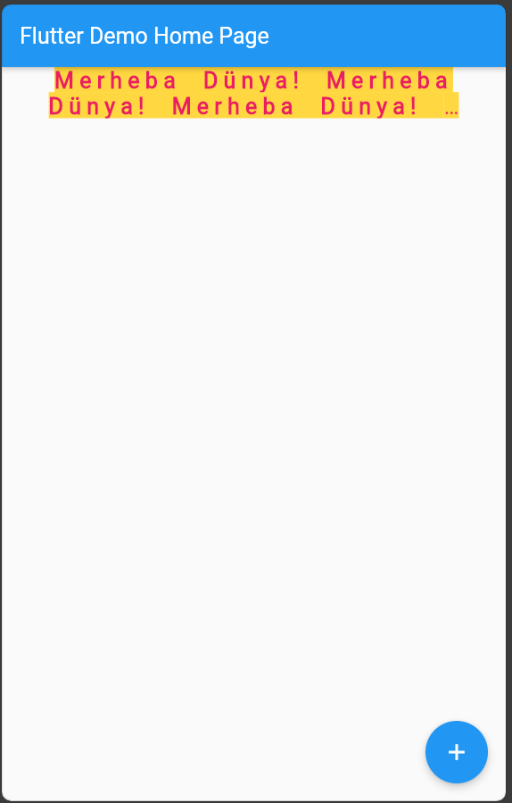

# Text

Bu widget mobil uygulamalarda ekranda bir metnin gösterilmesini istediğimizde kullanılır. Daha önceki derslerimizde AppBar widgetının title özelliğine Text widgetını atayarak kullanmıştırk. 

Text widget ve diğer widgetlar genelde Flutter içindeki Laout Widgetlar içinde kulllanılır. Bunlar kapsayıcı widgetlardır. Container, Column,Row vb. Bu kapsayıcı widgetlar kullanılmadan tek başına kullanılan widgetların bazı özelliklerini değiştiremeyiz. Ayrıca bu kapsayıcı widgetlar ekranda birden fazla widgetın ekranda gösterilmesine olanak verir.

Şimdi Text widgetının özelliklerini inceleyelim. Text widgetının align özelliklerini görebilmek için bu widgetı Container widgetının child özelliğine atadık.
Text widgetının yazı sitillerini TextStyle sınıfı ile değiştirebiliriz.

Not:' "Merhaba Dünya! " * 20 ' komutu ile Merhaba Dünya! yazısı ekranda 20 kere tekrar edilir. Böylece uzun bir yazı elde ettik.

````
Container(
    width: 500,
    child: Text(
      "Merheba Dünya! " * 20,
      textAlign: TextAlign.center,
      overflow: TextOverflow.ellipsis,
      maxLines: 2,
      style: const TextStyle(
          color: Colors.pink,
          fontWeight: FontWeight.bold,
          fontSize: 20,
          letterSpacing: 5,
          wordSpacing: 10,
          backgroundColor: Colors.amberAccent),
    ))

````


##Uygulama ve Kodu



````

//main.dart

import 'package:flutter/material.dart';

void main() {
  runApp(const MyApp());
}

class MyApp extends StatelessWidget {
  const MyApp({super.key});

  // This widget is the root of your application.
  @override
  Widget build(BuildContext context) {
    return MaterialApp(
      title: 'Flutter Demo',
      debugShowCheckedModeBanner: false,
      theme: ThemeData(
        primarySwatch: Colors.blue,
      ),
      home: Scaffold(
        appBar: AppBar(
          title: const Text('Flutter Demo Home Page'),
        ),
        body: Container(
          width: 500,
          child: Text(
            "Merheba Dünya! " * 20,
            textAlign: TextAlign.center,
            overflow: TextOverflow.ellipsis,
            maxLines: 2,
            style: const TextStyle(
                color: Colors.pink,
                fontWeight: FontWeight.bold,
                fontSize: 20,
                letterSpacing: 5,
                wordSpacing: 10,
                backgroundColor: Colors.amberAccent),
          ),
        ),
        floatingActionButton: FloatingActionButton(
          onPressed: () {},
          tooltip: 'Increment',
          child: const Icon(Icons.add),
        ),
      ),
    );
  }
}


````
