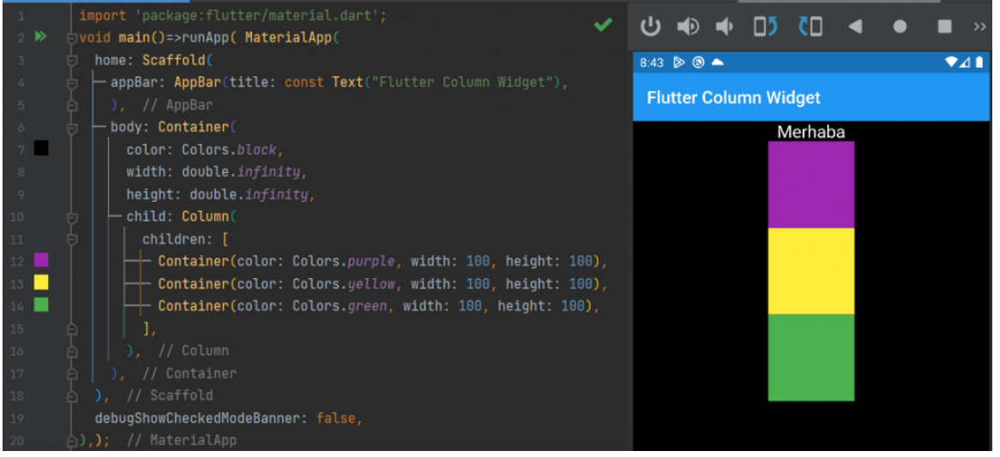
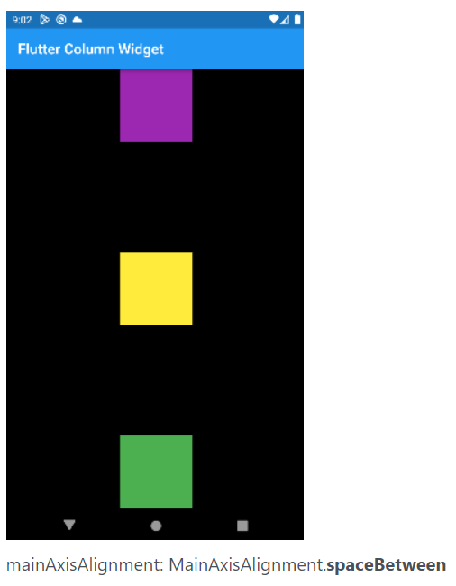

# Column Widget
İçerisine aldığı widgetların dikey bir şekilde konumlanmasını sağlayan kapsayıcı bir widget’tır. Sütun anlamına gelir. En önemli özelliklerinden biri içerisinde bulunan childeren[ ] parametresi ile içerisine birden fazla widget alabilmesidir.

## Flutter Column Widget Özellikleri
**childeren[ ]**  – liste yapısı sayesinde içerisine birden fazla widget eklenebilir.
**mainAxisAlignment** – İçerisindeki widget’ların dikey konumlandırması yapılır. (önemli, aşağıda inceleyin). Row için yatay yapar.
**crossAxisAlignment** – İçerisindeki widget’ların yatay konumlandırması yapılır. (önemli, aşağıda inceleyin). Row için dikey yapar.
**mainAxisSize** – Satırın dikeyde ne kadar bir alan kaplayacağı belirtilir. max ve min olarak değer alır.
**verticalDirection** – Hizamanın yukarıdan aşağı mı yoksa aşağıdan yukarımı olacağı belirlenir. up(yukarıdan aşağıya) ve down(aşağıdan yukarı) değer alır.

## Flutter Column Widget mainAxisAlignment Özelliği
**mainAxisAlignment**: Column Widget içerisindeki öğelerin dikey eksende nasıl konumlanacağını ayarlar. Ancak buradaki önem Row Widget yani satır widget’ı için durumun farklı olmasıdır. Bununda sebebi Column dediğimiz yapı bir sütun, dikey bir yapıdır. mainAxisAlignment ise ana eksen anlamına gelir. Yani sütunun ana ekseni dikeydir. Bu yüzden dikeyde hizalar. Row yani satır yapısında ise ana eksen yataydır. Bu yüzdende yatayda hizalama yapılır.

mainAxisAlignment verebileceğimiz parametreler
**center, end, spaceAround, spaceBetween, spaceEvenly, start**

## Flutter Column Widget crossAxisAlignment Özelliği

**crossAxisAlignment** Column Widget için yatayda hizalama sağlar. Ana eksenin (mainAxisAligment) tersi yönünde diye aklımızda kalırsa daha iyi olur. Çünkü Column Widget’ının yani satırın ana ekseni dikey oluyor. Bu durum Row Widget’ında değişiyor. Row ana ekseni yataydır.

crossAxisAlignment verebileceğimiz parametreler
**center, end, start, strech**

