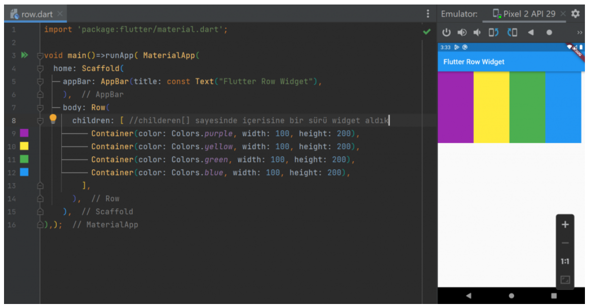
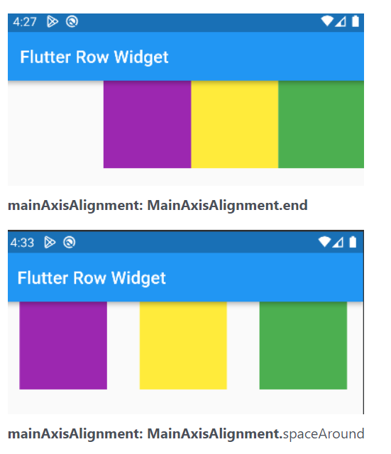
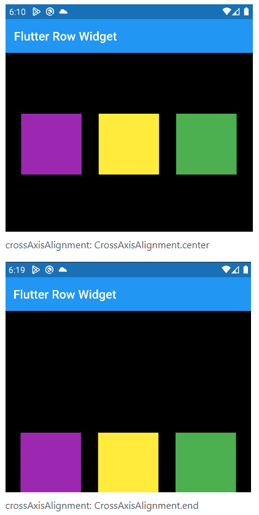

# Row Widget (Temel Yerleşim Widgetı)

Widgetları içerisine yan yana alan kapsayıcı bir widgettır. Satır Anlamına gelir. En önemli özelliklerinden biri içerisinde bulunan childeren[ ] parametresi ile yan yana birden fazla widget alabilmesidir.

## Flutter Row Widget Özellikleri
Burada çok özet listeledim ancak aşağıda örnekleri ile açıkladım.

**childeren[ ] **– liste yapısı sayesinde içerisine birden fazla widget eklenebilir.
**mainAxisAlignment** – İçerisindeki widget’ların yatay konumlandırması yapılır. (önemli, aşağıda inceleyin). Column için dikey yapar.
**crossAxisAlignment** – İçerisindeki widget’ların dikey konumlandırması yapılır. (önemli, aşağıda inceleyin). Column için yatay yapar.
**mainAxisSize** – Satırın yatayda ne kadar bir alan kaplayacağı belirtilir. max ve min olarak değer alır.
**textDirection** – Hizamanın soldan mı yoksa sağdan mı başlayacağının belirlendiği alandır. ltr(soldan sağa), rtl(sağdan sola) değer alır.

## Flutter Row Widget mainAxisAlignment Özelliği
**mainAxisAlignment**: Row Widget içerisindeki öğelerin yatayda nasıl konumlanacağını ayarlar. Ancak buradaki önem Column Widget yani sütün widget’ı için durumun farklı olmasıdır. Bununda sebebi row dediğimiz yapı bir satır, yatay bir yapıdır. mainAxisAlignment ise ana eksen anlamına gelir. Yani satırını ana ekseni yataydır. Bu yüzden yatayda hizalar. Column yani sütun yapısında ise ana eksen dikeydir. Bu yüzdende dikeyde hizalama yapılır.

mainAxisAlignment verebileceğimiz parametreler
**center, end, spaceAround, spaceBetween, spaceEvenly, start**

## Flutter Row Widget crossAxisAlignment Özelliği
**crossAxisAlignment** Row Widget için dikeyde hizalama sağlar. Ana eksenin (mainAxisAligment) tersi yönünde diye aklımızda kalırsa daha iyi olur. Çünkü Row Widget’ının yani satırın ana ekseni yatay oluyor. Bu durum Column Widget’ında değişiyor. Column ana ekseni dikeydir.

Şimdi crossAxisAlignment‘ı daha iyi anlamak için Row Widget’ımızı siyah bir Container Widget içerisine alamım. Container’ımıza yatayda ekranı tamamen kaplayacak ama yüksekliği 300 olacak şekilde boyutlandırıyorum. Bu şekilde boyutlandırınca Row Widgetımda kendini Container ölçülerinde boyutlandırıyor. Ben artık mainAxisAlignment ile yatayda konumlandırma, crossAxisAlignment dikeyde konumlandırma yapabiliyorum.

crossAxisAlignment verebileceğimiz parametreler
**center, end, start, strech**

Kaynak: https://www.yazilimdili.net/flutter-programlama/flutter-widget-class-sinif/flutter-column-widget-class-nedir/
