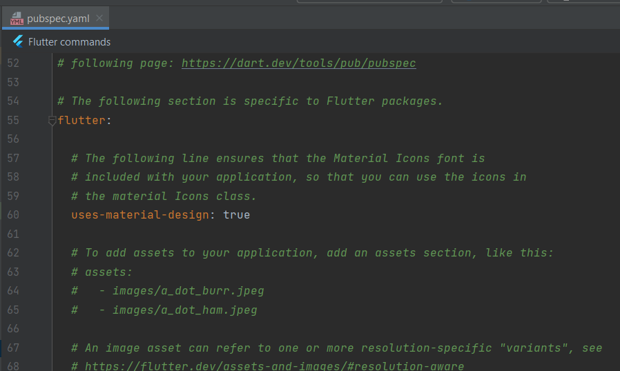
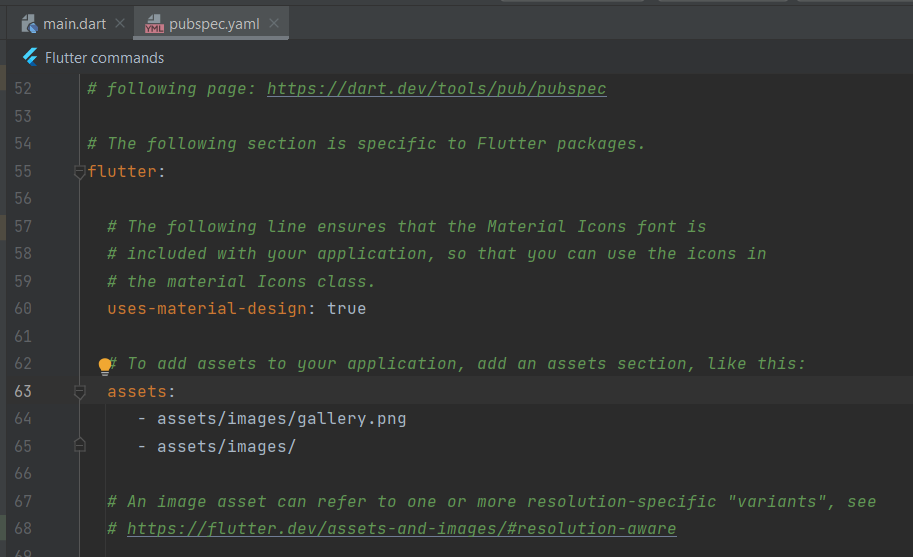
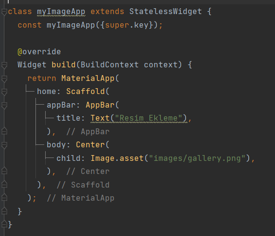
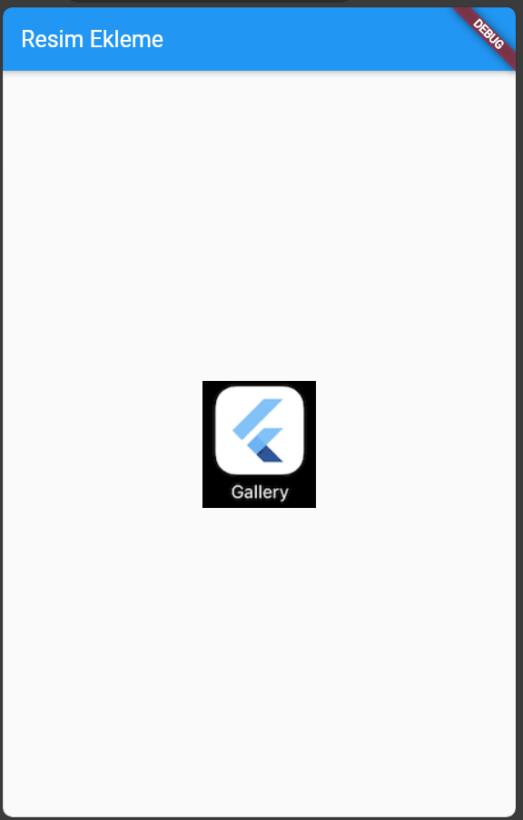

# Image - Temel Widget

Image widgetı, uygulamamalarımızda sıkça kullanacağımız resimleri projelerimizde göstermek için kullanılan widgettır. 
Image widgetı projemize 4 farklı ortamdan resim ekleme imkanı sunar.
Bunlar;
  **Asset** : Projemize dahil edilen kalsörlerin içindeki resimleri kullanmamızı sağlar.
  **Network** : İnternet üzerindeki farklı kaynaklardaki resimleri URL'leri ile kullanmamızı sağlar.
  **File** : Sistemdeki dosya yolunu göstererek resimleri kullanmamızı sağlar. 
  **Memory** : Sistem hafısaındaki resimleri ekler.

Biz buradaki uygulamamızda assets kullanımını anlatacağız.

Assets kullanımı için, öncelikle resimlerinizi projenizde saklayacağınız bir dizin oluşturup resimlerinizi oraya kopyalamalısınız. Bu işlemden sonra resimler ile ilgili pubspec.yaml dosyasında gerekli assets ayarı yapılmalıdır.

Genellikle projelerimizde saklayacağımız resimler, fontlar veya diğer dosyalar için proje ana dizini içerisinde assets klasörü oluşturup bu dosyaları bu klasörün içerisinde ayrı dizinlerde gruplandırırız.
Bi projemizde resimlerimi için ana dizin içerisinde assets kalsörü ve onun içinde images klasörü oluşturduk.

Daha sonra ana dizin içerisnde pubspec.yaml içersinde bulunan assets images satırları açıklama dışına alınıp projenizdeki yapı ve resim isimlerine uyun olarak düzenlenir. Düzenleme işlemi bittikten sonra sağ üstte popup olarak çıkan **"Pub get" komutu çalıştırılır veya terminal üzerinden "flutter pub get" komutunu** da çalıştırabilirsiniz.

Burada resimlerimizi ister ilk image satırında olduğu gibi teker teker ekleyebildiğimiz gibi istersek direk resimlerin bulunduğu dizini ekleyebiliriz.

Projemize resim eklemek için Image widgetı kullanılır.

