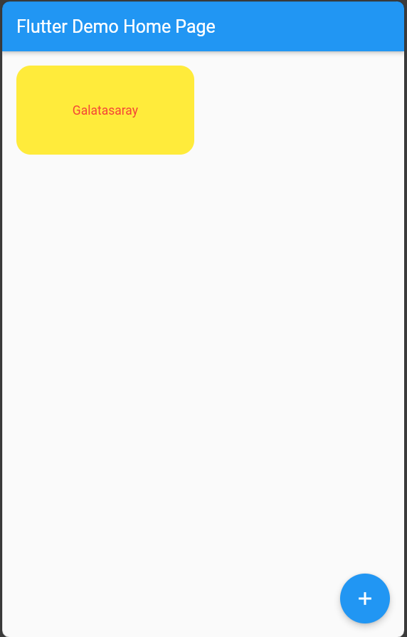

# Ders 7 - Temel Widgetlar - Container

# Container

Bu widget bir konumlandırm, dekore etme ve boyutlandırma widgetıdır. İçndeki nesnlerin boyutlarını konumlarını ve kutu dekorasyonu gibi özelliklerini belirlemek için kullanılır.

Örneğin ekrana yazdırılacak bir metnin ekran üzerindeki konumu, boyutu ve çerçeve özellikleri Conatainer kapsayıcı widgetı ile değiştirilebilir.

````

Container(
          decoration: BoxDecoration(
            shape: BoxShape.rectangle,
            borderRadius: BorderRadiusDirectional.circular(16.0),
            color: Colors.yellow,
          ),
          width: 200,
          height: 100,
          alignment: Alignment.center,
          margin: EdgeInsets.all(16.0),
          padding: EdgeInsets.all(16.0),
          child: const Text(
            "Galatasaray",
            style: const TextStyle(
            color: Colors.red,
),
          ),
        ),

````


## Uygulama




````

//main.dart

import 'package:flutter/material.dart';

void main() {
  runApp(const MyApp());
}

class MyApp extends StatelessWidget {
  const MyApp({super.key});

  // This widget is the root of your application.
  @override
  Widget build(BuildContext context) {
    return MaterialApp(
      title: 'Flutter Demo',
      debugShowCheckedModeBanner: false,
      theme: ThemeData(
        primarySwatch: Colors.blue,
      ),
      home: Scaffold(
        appBar: AppBar(
          title: const Text('Flutter Demo Home Page'),
        ),
        body: Container(
          decoration: BoxDecoration(
            shape: BoxShape.rectangle,
            borderRadius: BorderRadiusDirectional.circular(16.0),
            color: Colors.yellow,
          ),
          width: 200,
          height: 100,
          alignment: Alignment.center,
          margin: EdgeInsets.all(16.0),
          padding: EdgeInsets.all(16.0),
          child: const Text(
            "Galatasaray",
            style: TextStyle(
              color: Colors.red,
            ),
          ),
        ),
        floatingActionButton: FloatingActionButton(
          onPressed: () {},
          tooltip: 'Increment',
          child: const Icon(Icons.add),
        ),
      ),
    );
  }
}


````


