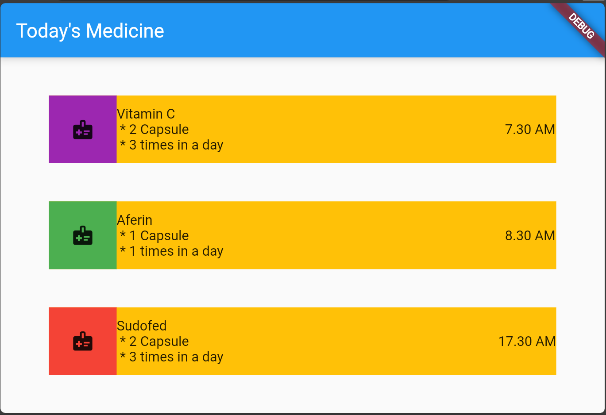
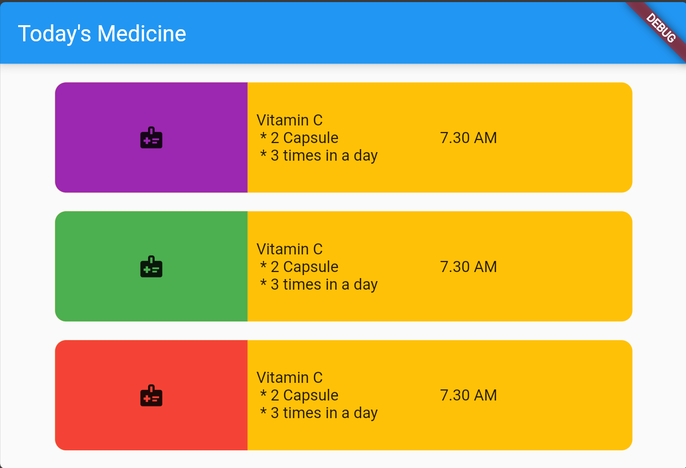

# Ödev

**Column**, dikey yerleşim widgetı olarak kullanılır.

**Row**, yatay yerleşim widgetı olarak kullanılır.

**Expanded**, içine eklenen nesneleri dahil olduğu widgetın tüm genişiliği kadar yayar. Ekran büyüklüğünün değişmesi durumunda widget genişliği de otomatik olarak değişir.

## Görev 1
Column, Row ve Expanded Widgetlarını kullanarak aşağıdaki ekranı oluşturunuz.

## Görev 2
**Bu ödevin kodu [buradaki main.dart dosyası içinde](main.dart) bulunmaktadır.** Containerların içine yazılan yazıların çerveden uzakta yazmasını sağlamak ve etrafında boşluk bırakmak için Paddng Widgetı ile Container Widgetının padding özelliklerini araştırınız ve bu ödeve uygulayınız.

## Görev 3
Container widgetının **boxdecoration** özelliğini arştırınız ve projeye uygulayınız.

## Görevler sonucunda projenin son halini 2. resimdeki duruma getiriniz.

### Resim 1

### Resim 2
